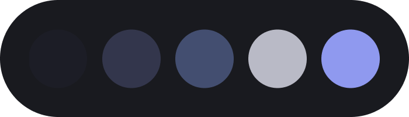

<h3 align="center"></h3>

# Night Shade
Night Shade theme for various applications.

## Supported Apps
- [Discord](https://github.com/liferuin/night-shade-discord)
- [Firefox](https://github.com/liferuin/night-shade-firefox)
- [Visual Studio Code](https://github.com/liferuin/night-shade-vscode)

## Palette
<table>
    <tr>
        <th>Color</th>
        <th>Role</th>
        <th>Hex</th>
    </tr>
    <tr>
        <th></th>
        <th><code>base</code></th>
        <th><code>#17171C</code></th>
    </tr>
    <tr>
        <th></th>
        <th><code>surface</code></th>
        <th><code>#191A1F</code></th>
    </tr>
    <tr>
        <th></th>
        <th><code>overlay</code></th>
        <th><code>#21222C</code></th>
    </tr>
    <tr>
        <th></th>
        <th><code>muted</code></th>
        <th><code>#626584</code></th>
    </tr>
    <tr>
        <th></th>
        <th><code>subtle</code></th>
        <th><code>#8F91A3</code></th>
    </tr>
    <tr>
        <th></th>
        <th><code>text</code></th>
        <th><code>#C7C8D1</code></th>
    </tr>
    <tr>
        <th></th>
        <th><code>accent</code></th>
        <th><code>#5764DB</code></th>
    </tr>
</table>
